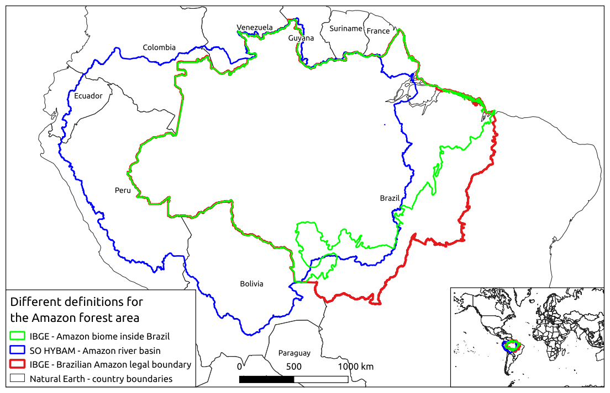

# The return of Crazy Data - Amazon Forest Fires
Presentation delivered in [FOSS4G 2019](https://2019.foss4g.org/) in 2019-10-30, room Simfonia at 14h00.

FOSS4G stands for Free and Open Source Software for Geospatial.

This work is [licenced CC BY-SA](https://creativecommons.org/licenses/by-sa/4.0/), the code is under the MIT license.

## Introduction
Five years ago, in the FOSS4G Portland conference, I gave a presentation entitled “Crazy Data”, and the focus was on tips and tricks to ingest, clean and process large amounts of vector data. This repository documents a “crazy data” exercise: downloading and processing data regarding the fires in the amazon forest up to August 27, 2019.

Many of the FOSS4G Bucharest participants have asked about the news of fires in the amazon forest. There are many questions and many different analyses to be made. For the purposes of this demonstration, the following question is proposed: “Is the amazon forest being burned in large rates?”

Since this issue is in the news and has a lot of controversy around it, it should be made clear that this work does not concern politics, ecology or relations of cause and effect, it merely demonstrates the execution of a geoprocessing task using FOSS4G tools and data that is difficult to handle to try to answer the proposed question. This is a complex subject and I believe one should ask questions focused on the decisions one has to make. What are you trying to decide? What questions you need answered to help you in your decision? Maybe this work will provide you with a workflow and a few tools to do your own research.

The whole process should be repeatable by anyone patient enough to go through the hacky code in this repository. If you have anything to add or fix, please submit a pull request.

## Motivation

### News coverage

A few results from the web search "amazon fires":

"NASA Satellites Confirm Amazon Rainforest Is Burning at a Record Rate" https://www.space.com/amazon-rainforest-fires-2019-nasa-satellite-views.html

"The Amazon in Brazil is on fire - how bad is it?" https://www.bbc.com/news/world-latin-america-49433767

"Everything you need to know about the fires in the Amazon" https://www.theverge.com/2019/8/28/20836891/amazon-fires-brazil-bolsonaro-rainforest-deforestation-analysis-effects

"Amazon Wildfires Are Horrifying, But They're Not Destroying Earth's Oxygen Supply" https://www.livescience.com/amazon-fires-are-not-depleting-earth-oxygen.html

### Cool maps for inspiration

http://www.globalfiredata.org/forecast.html

https://firms2.modaps.eosdis.nasa.gov/map/

## Problem statement

The proposed question is “Is the amazon forest being burned at a high rate?”. Let’s break this question down:

### Where is the amazon forest?

The area of the Amazon forest can be defined in at least three ways:

* The area that the law says it's the Amazon forest, also called the "Legal Amazon". I have found this data only for Brazil.
* The area of the Amazon biome. Wikipedia defines a biome as "a community of plants and animals that have common characteristics for the environment they exist in". I have found this data only for Brazil.
* The area that is drained by the Amazon river. That area can be determined by processing the elevation data of a region.

The Amazon definition we use is the third one, as it is an objectively defined region, loosely agrees with the biome data from Brazil and spans all the countries that contain the Amazon forest. Also I had no other option since it would take time to source the data for the other two definitions. 

Data: The basin of the amazon river

Sources:

* Main polygon: http://www.ore-hybam.org/index.php/eng/Data/Cartography/Amazon-basin-hydrography

* Sanity check: WFS service from IBGE at "http://www.geoservicos.ibge.gov.br/geoserver/ows?service=wfs&version=2.0.0&request=GetCapabilities", Layer "CGEO:ANMS2010_03_biomas"

### How are burn rates measured?

NASA has FIRMS - the Fire Information for Resource Management System, which provides heat spot locations based on imagery from the MODIS and VIIRS sensors aboard several satellites. This does not directly measure burned area, there is even a FAQ about that. We will, however, use that data for comparison purposes.

Data:  NASA’s Fire Information for Resource Management System (FIRMS) reports.

QGis screenshot of the MODIS data from September 27 to August 27, scale 1:10 million. Acre region - Amazon, South America:

QGis screenshot of the MODIS data from September 27 to August 27, scale 1:10 million (same as above). Acre region - Amazon, South America:
Congo, Angola and Zambia region - Central Africa:

Source: https://firms2.modaps.eosdis.nasa.gov/

Some caveats (non-exhaustive):

https://earthdata.nasa.gov/faq/firms-faq#ed-fire-on-ground
> What does a fire detection mean on the ground?

https://earthdata.nasa.gov/faq/firms-faq#ed-modis-fire-size
> What size fires can be detected?
> ... Under pristine (and extremely rare) observing conditions even smaller flaming fires 50 m2 can be detected. ...

https://earthdata.nasa.gov/faq/firms-faq#ed-active-fire-burnedarea
> Can I estimate burned area from active fire data?
> 
> It is not recommended to use active fire locations to estimate burned area due to spatial and temporal sampling issues. Determining this to an acceptable degree of accuracy is generally not possible due to nontrivial spatial and temporal sampling issues. For some applications, however, acceptable accuracy can be achieved, although the effective area burned per fire pixel is not simply a constant, but rather varies with respect to several different vegetation and fire-related variables. See Giglio et al. (2006) for more information.
See "Where can I get the MODIS burned area product?"

https://earthdata.nasa.gov/faq/firms-faq#ed-modis-burnedarea
> Where can I get the MODIS burned area product?
>
> MODIS Active Fire & Burned Area Products web site and the MODIS Burned Area User Guide (Updated May 2013) and the MODIS Collection 6 Active Fire Product User's Guide. 

### What does it mean for a rate to be high or low?

This is unclear, but we try to answer this by comparing the measured rate to similar data in other times and in other places.

Data: MODIS and VIIRS data, country boundaries. Country boundaries, Brazilian state boundaries. Plot of FIRMS data for several areas and time intervals.

Source: same fire data as (2), also https://www.naturalearthdata.com/downloads/50m-cultural-vectors/50m-admin-0-countries-2/ and the IBGE WFS service at http://www.geoservicos.ibge.gov.br/geoserver/ows?service=wfs&version=2.0.0&request=GetCapabilities layer CCAR:BC250_Unidade_Federacao_A

### What time frame are we talking about?

We assume that the fires have an yearly cycle, so we compare the amount of accumulated heat spots since the beginning of each year.

Data: same as (3)

Source: same as (2)

## Processing

***Warning - Random notes and erratic presentation ahead***

Steps:

Go to each portal and download the file data.

Had to resort to the 60GB gsm chip I bought at the airport.
 
Create a schema in a local postgresql+postgis database.

Why postgresql and not spatialite/geopackage? Should also work, but I was cautious because of the size of the data. Also I wanted to use nice features like materialized views.

Start QGis

Create a connection to the WFS services

Create a connection to the local database

Load the data from the WFS service and the local files into the database (drag and drop)

Dragging and dropping did not work for the MODIS and VIIRS files because of the size, built a bash script.

Vacuum, Create spatial indexes

Filter biome data

Make a polygon, simplify the amazon basin

Merge the MODIS and VIRRS time interval tables to form only two time continuous tables.

I could have mostly skipped this step had I only downloaded the data in CSV instead. Lesson learned.

Perform some postgresql+postgis magic (see [scripts/3_process_data.sql](scripts/3_process_data.sql))

Postgresql magic took a lot of time, there are obviously better ways to partition the data and I believe it would be faster to do some of the processing outside the database with CSV files.

*Zoom IN* BEFORE enabling the heat spots.

Plot the results

Enable scale dependent visibility

If you want to see the result of the queries, enable layers without geometry

How crazy is this data?

Fire occurrences table after dropping unused columns and VACUUM ANALYZE:

109991792 (110 million rows)

Table size: 8859 MB

Indexes size: 13 GB

## Results

All graphics are displayed with two curves - the top one is the absolute number of fire spots and the bottom one is that number divided by 1000 square kilometers. 

The top curve is limited to the 10 items with the most fire spots.

The bottom curve gives an idea of the density of the fire spots in the area, and uses the same itens as the top curve but orders them by greater density first.

### Fires in the Amazon region
These give a false impression that 2019 had less fire spots.

The area used to calculate fire spot density is only the area that interesects the Amazon basin.

### Fires in the Amazon region only until August 27 of each year

Why? Because 2019 is not over yet and it is fire season now, so we have to disregard data after August 27 to be able to compare one year with the other.

The area used to calculate fire spot density is only the area that interesects the Amazon basin.

### Brazilian Amazon fires by state

The area used to calculate fire spot density is only the area that interesects the Amazon basin.

Modis series dating from 2001

VIIRS series dating from 2012

### Brazilian Amazon fires by municipality

The area used to calculate fire spot density is only the area that interesects the Amazon basin.

Modis series dating from 2001

VIIRS series dating from 2012

### Fires in all the countries of the world

The area used to calculate fire spot density is the entire area of the countries and all fire spots are considered. It would be better to use just the forest polygons for each country, but since I don't have that, we use the entire area and all the fire spots to make an estimate.

MODIS series since 2016

Why no VIIRS? My machine ran for 3 hours then crashed when trying to process those.
